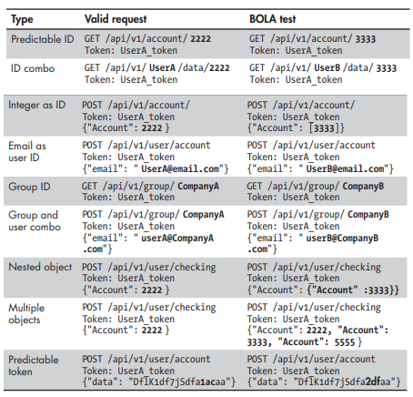

# What is OWASP?
The Open Web Application Security Project (OWASP) is an international non-profit organization dedicated to web application security. OWASP API Security Top Ten and Beyond! is meant to help improve the skills of bug bounty hunters, developers, penetration testers, organizational leadership, and anyone else interested in learning about API security.

## Course Objectives
The OWASP API Security Top 10 is a list of the most critical security risks for Application Programming Interfaces. Develop a strong foundation in the following API security risks:
* **API1:2023 :** Broken Object Level Authorization
* **API2:2023 :** Broken Authentication
* **API3:2023 :** Broken Object Property Level Authorization
* **API4:2023 :** Unrestricted Resource Consumption
* **API5:2023 :** Broken Function Level Authorization
* **API6:2023 :** Unrestricted Access to Sensitive Business Flows
* **API7:2023 :** Server Side Request Forgery
* **API8:2023 :** Security Misconfiguration
* **API9:2023 :** Improper Inventory Management
* **API10:2023 :** Unsafe Consumption of APIs

## API1:2023 Broken Object Level Authorization
### Description
BOLA vulnerabilities occur when an API provider does not have sufficient controls in place to enforce authorization. In other words, API users should only have access to sensitive resources that belong to them. When BOLA is present an attacker will be able to access the sensitive data of other users. Example:
* GET /api/user/1
* GET /user/account/find?user_id=aE1230000token
* POST /company/account/Apple/balance
* GET /admin/settings/account/bman

### Preventative Measures
In order to improve API security, it is important to implement robust authorization controls. These controls should consider user policies and role-based access control hierarchies. The primary focus should be to ensure that authenticated users only have access to resources they are authorized to have access to. Using less predictable resource IDs can increase the challenge of a user or attacker guessing the resource IDs of other users. Developers should perform tests that specifically test authorization controls. 

* Implement a proper authorization mechanism that relies on the user policies and hierarchy.
* Use the authorization mechanism to check if the logged-in user has access to perform the requested action on the record in every function that uses an input from the client to access a record in the database.
* Prefer the use of random and unpredictable values as GUIDs for records' IDs.
* Write tests to evaluate the vulnerability of the authorization mechanism. Do not deploy changes that make the tests fail.

## API2:2023 Broken Authentication
### Description
Attackers can gain complete control of other user's accounts in the system, read their personal data, and perform sensitive actions on their behalf. Systems are unlikely to be able to distinguish attacker's actions from legitimate user ones.

###### Weak Password Policy
A weak password policy does not sufficiently protect user accounts by enforcing strong password creation and management.
* Allows users to create simple passwords
* Allows brute force attempts against user accounts
* Allows users to change their password without asking for password confirmation
* Allows users to change their account email without asking for password confirmation
* Discloses token or password in the URL
* GraphQL queries allow for many authentication attempts in a single request
* Lacking authentication for sensitive requests

###### Credential Stuffing
Credential stuffing is a type of attack against authentication where a large number of username and password combinations are attempted. Credentials used in these types of attacks are typically collected from data breaches. 
* Allows users to brute force many username and password combinations

###### Predictable Tokens
Predictable tokens refer to any token obtained through a weak token generation authentication process. Weak tokens can easily be guessed, deduced, or calculated by an attacker.
* Using incremental or guessable token IDs

###### Misconfigured JSON Web Tokens
JSON Web Tokens (JWTs) are commonly used for API authentication and authorization processes. JWTs provide developers with the flexibility to customize which algorithm is used for signing the token, the key/secret that is used, and the information used in the payload. This customization allows for plenty of room for security misconfigurations to occur.
* API provider accepts unsigned JWT tokens
* API provider does not check JWT expiration
* API provider discloses sensitive information within the encoded JWT payload
* JWT is signed with a weak key

### OWASP Preventative Measures
* Make sure you know all the possible flows to authenticate to the API (mobile/ web/deep links that implement one-click authentication/etc.). Ask your engineers what flows you missed.
* Read about your authentication mechanisms. Make sure you understand what and how they are used. OAuth is not authentication, and neither are API keys.
* Don't reinvent the wheel in authentication, token generation, or password storage. Use the standards.
* Credential recovery/forgot password endpoints should be treated as login endpoints in terms of brute force, rate limiting, and lockout protections.
Require re-authentication for sensitive operations (e.g. changing the account owner email address/2FA phone number).
Use the OWASP Authentication Cheatsheet.
Where possible, implement multi-factor authentication.
Implement anti-brute force mechanisms to mitigate credential stuffing, dictionary attacks, and brute force attacks on your authentication endpoints. This mechanism should be stricter than the regular rate limiting mechanisms on your APIs.
Implement account lockout/captcha mechanisms to prevent brute force attacks against specific users. Implement weak-password checks.
API keys should not be used for user authentication. They should only be used for API clients authentication.
